<!-- ═══════════════════════════  HXST1 :: PROFILE  ═══════════════════════════ -->

<p align="center">
  <a href="https://edu-ruiz-portfolio.vercel.app/">
    
  </a>
</p>

<p align="center">
  <a href="https://edu-ruiz-portfolio.vercel.app/"></a>
  <a href="https://www.linkedin.com/in/edu-ruiz-cantos/"></a>
  <a href="https://x.com/_hxst"></a>
  <a href="https://instagram.com/edu.r__"></a>
  
</p>

<br>

## <samp>&gt; whoami</samp>

```yaml
user:      Edu Ruiz  # aka hxst
role:      Full-Stack Developer
building:  tools for developers — fast, focused, zero bloat
into:      agent-first workflows · emulation & low-level · DX
currently: shipping Beacon-Split, a workspace for Claude Code sessions
motto:     build → ship → iterate → repeat
```

## <samp>&gt; ls -la ./projects</samp>

<table>
  <tr>
    <td width="50%" valign="top">
      <samp><b>▸ <a href="https://github.com/hxst1/Beacon-Split">Beacon-Split</a></b></samp>
      <br><sub><code>rust</code></sub>
      <p>Agent-first development workspace. Manage Claude Code sessions, terminals, files and Git across multiple projects at once — zero context switching.</p>
    </td>
    <td width="50%" valign="top">
      <samp><b>▸ <a href="https://github.com/hxst1/Gameboy4me">Gameboy4me</a></b></samp>
      <br><sub><code>rust</code> <code>wasm</code> <code>next.js</code></sub>
      <p>Low-level hardware emulation of the classic Game Boy architecture, compiled to WebAssembly and playable in the browser.</p>
    </td>
  </tr>
  <tr>
    <td width="50%" valign="top">
      <samp><b>▸ <a href="https://github.com/hxst1/Colors4dev">Colors4dev</a></b></samp>
      <br><sub><code>next.js</code> <code>typescript</code></sub>
      <p>Instant accessible palette generator with built-in WCAG contrast checks and CSS, Tailwind &amp; SCSS exports.</p>
    </td>
    <td width="50%" valign="top">
      <samp><b>▸ <a href="https://github.com/hxst1/Json4dev">Json4dev</a></b></samp>
      <br><sub><code>next.js</code> <code>typescript</code></sub>
      <p>Modern, ultra-fast JSON formatter, validator and minifier built for developer productivity.</p>
    </td>
  </tr>
</table>

## <samp>&gt; cat ~/.stack</samp>

<p align="center">
  <samp><sub>// languages</sub></samp><br>
  
  <br><br>
  <samp><sub>// frontend</sub></samp><br>
  
  <br><br>
  <samp><sub>// backend &amp; data</sub></samp><br>
  
  <br><br>
  <samp><sub>// infra, tooling &amp; testing</sub></samp><br>
  
</p>

## <samp>&gt; top -u hxst1</samp>

<p align="center">
  
  
</p>

<p align="center">
  
</p>

<p align="center">
  <picture>
    <source media="(prefers-color-scheme: dark)" srcset="https://raw.githubusercontent.com/hxst1/hxst1/output/snake-dark.svg" />
    <source media="(prefers-color-scheme: light)" srcset="https://raw.githubusercontent.com/hxst1/hxst1/output/snake.svg" />
    
  </picture>
</p>

<p align="center"><samp><sub><i>* language metrics cover public repos only and don't reflect total experience.</i></sub></samp></p>

---

<p align="center">
  <samp>[ <b>BUILDING</b> // <b>SHIPPING</b> // <b>ITERATING</b> ] &nbsp;·&nbsp; <a href="https://edu-ruiz-portfolio.vercel.app/">connection established — say hi</a></samp>
</p>
